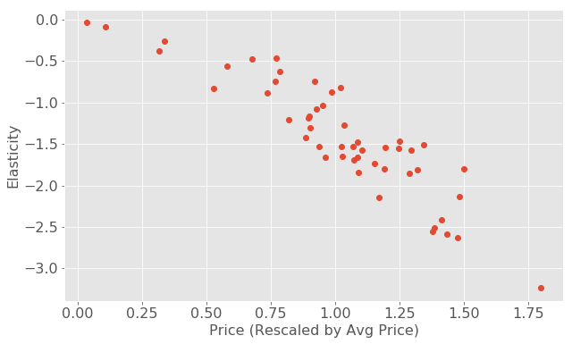
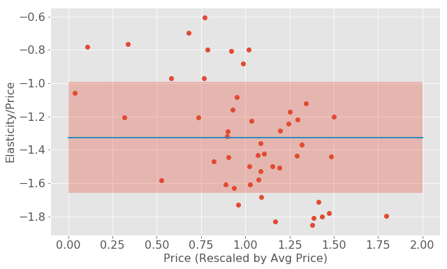
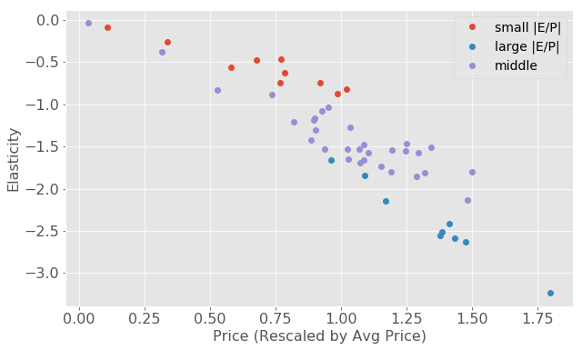
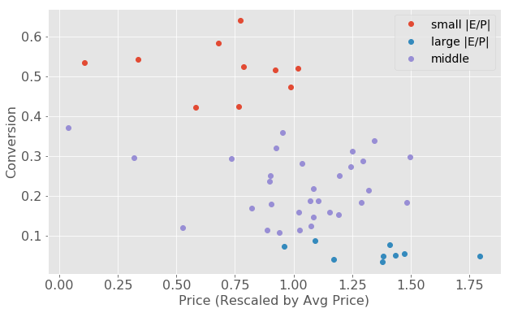
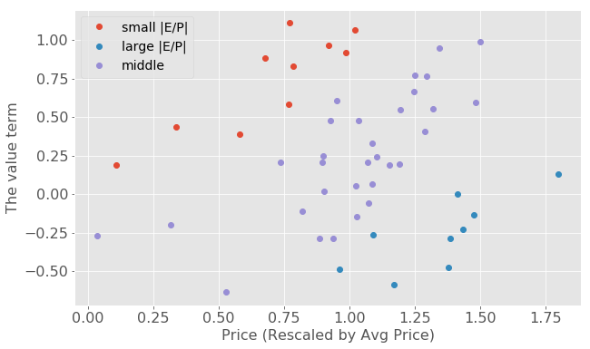

title: Understanding the price elasticity of demand from an item response model point of view
tags:
	- price elasticity
	- item response model
categories: economics
date: 2018-08-12
---

> Price elasticity of demand (PED or Ed) is a measure used in economics to show the responsiveness, or elasticity, of the quantity demanded of a good or service to a change in its price when nothing but the price changes. More precisely, it gives the percentage change in quantity demanded in response to a one percent change in price.
> 
> --[wikipedia](https://en.wikipedia.org/wiki/Price_elasticity_of_demand)

<!-- more -->

Price elasticity is an important economic concept that will help with forecasting your sales and setting prices. For instance, you can forecast the impact of a change in price on sales volume and sales revenue. If a small change in price is accompanied by a large change in quantity demanded, the product is said to be elastic (or responsive to price changes). On the other hand, a product is deemed inelastic if a large change in price is accompanied by a small amount of change in quantity demanded. For the past a few months, I've been struggling to understand the price elasticity of products at work. In this blog post, I want to start from a theoretical point of view and derive the asymptotic behavior for elasticity as a function of price. You will see a lot of equations in today's post, don't panic!

Suppose we have $N$ products, each with price $P_n$, and send them out to $M$ customers. At each event $u$($u$ means box unit), when customer $m$ receives product $n$, the probability of purchase is captured by the following item-response-type model with price as an additional feature:
$$\text{prob}_u =  \text{prob} _{m,n} =\sigma (c(v _n + \delta v _m - P _n))$$

Here, $\sigma$ is the sigmoid function, $P_n$ is the price of the product, $v_n$ represents the "value" of the product, $\delta v _m$ represents the customer's budget preference, meaning how much more or less she's willing to pay than average. $v_n$ and $\delta v _m$ both have the same unit with price. The coefficient $c$, with the unit of inverse price, characterizes how strongly the probability depends on the price. Note that $c P$ is a dimensionless number.

Now we are going to derive the price elasticity from this item-response model and understand the relationship between the elasticity and other properties of the product such as the price and average conversion rate.

## Analytical Derivation

The price elasticity of demand for a product is defined as the percentage change in quantity demanded in response to one percent change in its price.
$$ E _n = \frac{dQ _n/Q _n} {d P _n / P _n}$$

**Let us make an assumption that we are always going to send the product to the same group of customers when changing its price**, then the relative change in demand can be calculated as the relative change in the average purchase probability:
$$ \frac{d Q _n }{ Q_n} = \frac{d\sum_{\{m_n\}} \text{prob}_{m,n}}{\sum_{\{m_n\}} \text{prob}_{m,n}}$$
where $\{m _n\}$ represents the customers that product $n$ has been sent to.

Therefore we have 
$$ E_n = \frac{d \sum_{\{m_n\}} \sigma(c(v_n + \delta v_m - P_n))}{dP_n} \cdot \frac{P_n}{\sum_{\{m_n\}} \sigma(c(v_n + \delta v_m - P_n))}$$

Define $f(n, m) = c ( v _n + \delta v _m - P _n)$, then we have
$$ \frac{d \sum_{\{m_n\}} \sigma(f_{m,n})} {d P_n} = \sum_{\{m_n\}} \sigma(f_{m,n}) (1-\sigma(f_{m,n})) \cdot \frac{df_{m,n}}{dP_n} = -c \sum_{\{m_n\}} \sigma(f_{m,n}) (1-\sigma(f_{m,n}))$$

$$\Rightarrow E_n =  -P_n \cdot \frac{c \cdot \sum_{\{m_n\}} \sigma(f_{m,n}) (1-\sigma(f_{m,n}))}{\sum_{\{m_n\}} \sigma(f_{m,n})} = -P_n \cdot \frac{ c \cdot \langle \sigma(f_{m,n}) (1-\sigma(f_{m,n}))\rangle_{m_n}}{\langle \sigma(f_{m,n})\rangle_{m_n}}$$

In physics, the sigmoid function (Fermi-Dirac distribution) $\sigma(x) = \frac{1}{1+ e^{-cx}}$ defines the occupation of fermions over possible energy states and the derivative of the Fermi distribution gives the Fermi surface. In the limit of $c \to \infty$ (equivalent to zero-temperature limit), the Fermi distribution becomes a step function $sgn(x)$, and its derivative becomes a delta function $\delta(x)$. As $c$ decreases (finite temperature), the step function softens and the derivative becomes a finite range distribution around $x=0$. [see this figure](https://www.researchgate.net/figure/Graph-of-the-Logistic-function-and-its-derivative-function_fig1_268874045)

Now let us try to get some intuition about the asymptotic behavior of $E_n$ in both the zero-temperature limit ($c \to \infty$) and the infinite-temperature limit ($c \to 0$) since these two limits are easier to calculate. 

Here we need to make another assumption: **the customer budget offset term $\delta v_m$ has a normal distribution with zero-mean and standard deviation $\sigma_C$: $\delta v_m \sim \mathcal{N}(0, \sigma_C^2)$.** 

In the limit of infinite $c$, the numerator of the equation now becomes:
$$
\begin{aligned}
& \lim _{c\to\infty}   c \cdot \langle \sigma(f _{m,n}) (1-\sigma(f _{m,n}))\rangle _{m _n} \\
&= \langle \delta (f _{m,n} ) \rangle _{m _n}  \\
&= \langle \delta (v _n + \delta v _m - P _n) \rangle _{m _n} \\
&\approx \int_{-\infty}^{+\infty} dx \frac{1}{\sqrt{2\pi} \sigma_C }e^{-x^2/2\sigma_C^2} \delta(x+v_n -P_n) \\
&= \frac{1}{\sqrt{2\pi} \sigma_C }e^{-(P_n-v_n)^2/2\sigma_C^2}
\end{aligned}
$$
which is a normal function with mean $P_n-v_n$ and standard deviation $\sigma_C$. When $c$ is a finite number, the infinitely sharp delta function becomes flatter, my intuition would be that this average will also have a wider tail than normal function. **If we assume that our current pricing strategy roughly captures the average value for the product, in other words that the difference between $P_n$ and $v_n$ does not deviate too far from zero and from each other**, the dependence of this function on $P_n$ should not be too strong.

The denominator of the equation represents the average conversion probability of the product. If we also use the assumption that $\delta v_m \sim \mathcal{N}(0, \sigma_C^2)$, then
$$
\begin{aligned}
& \lim_{c\to\infty} \langle \sigma(f_{m,n}) \rangle_{m_n}\\
&= \langle \text{sgn}(v_n + \delta v_m -P_n) \rangle_{m_n} \\
&\approx \int_{-\infty}^{+\infty} dx \frac{1}{\sqrt{2\pi} \sigma_C }e^{-x^2/2\sigma_C^2} \text{sgn}(x + v_n -P_n)\\
&= \int_{P_n-v_n}^{+\infty} dx \frac{1}{\sqrt{2\pi} \sigma_C }e^{-x^2/2\sigma_C^2} \\
&= \Phi(\frac{v_n-P_n}{\sigma_C})
\end{aligned}  
$$
where $\Phi$ is the cumulative distribution function for standard normal distribution. The [shape of this function](https://en.wikipedia.org/wiki/Normal_distribution#/media/File:Normal_Distribution_CDF.svg) is very similar to a sigmoid function. When $c$ is finite, this function is also likely to become even wider. **Again, suppose we are setting the price of our products to reflect the conversion rate, in other words, the price is set high for higher value products and vise versa**, then the average conversion probability should also not strongly correlate with price.

Put them together,
$$\Rightarrow \lim_{c\to\infty} E_n = -P_n \cdot \frac{1}{\sqrt{2\pi} \sigma_C} e^{-(P_n-v_n)^2/2\sigma_C^2} \frac{1}{\Phi(\frac{v_n - P_n}{\sigma_C})}$$

In the $c \to 0$ limit, the denominator of the equation becomes:
$$
\begin{aligned}
& \lim_{c\to 0} \langle \sigma(f _{m,n})\rangle _{m _n} \\
&= \langle \frac{1}{2} + \frac{1}{4} f_{m,n} + O(f_{m,n}^3) \rangle_{m_n} \\
&\approx \int_{-\infty}^{+\infty} dx \frac{1}{\sqrt{2\pi} \sigma_C }e^{-x^2/2\sigma_C^2} (\frac{1}{2} + \frac{1}{4} c (x+ v_n - P_n))\\
&= \frac{1}{2} + \frac{1}{4} c \cdot  (P_n - v_n)
\end{aligned}
$$
which has a constant leading term.

The numerator becomes:
$$
\begin{aligned}
& \lim _{c\to 0}   c \cdot \langle \sigma(f _{m,n}) (1-\sigma(f _{m,n}))\rangle _{m _n} \\
&= c \cdot \langle (\frac{1}{2} + \frac{1}{4} f_{m,n} + O(f^3)) ( \frac{1}{2} - \frac{1}{4} f_{m,n} + O(f^3))\rangle_{m_n}\\
&\approx c \cdot \int_{-\infty}^{+\infty} dx \frac{1}{\sqrt{2\pi} \sigma_C }e^{-x^2/2\sigma_C^2} (\frac{1}{4} - \frac{1}{16} c^2 (x + v_n - P_n)^2) \\
&= c \cdot [\frac{1}{4} -\frac{1}{16} c^2 (\sigma_C^2 + (P_n - v_n)^2)]
\end{aligned}
$$

Put it together, we have
$$ \Rightarrow \lim_{c\to 0} E_n = - c \cdot P_n \frac{\frac{1}{4} -\frac{1}{16} c^2 (\sigma_C^2 + (P_n - v_n)^2)}{\frac{1}{2} + \frac{1}{4} c \cdot  (P_n - v_n)}$$

From both limits, we can see a roughly linear relationship dominating the function $E_n(P_n)$. Therefore, in the finite $c$ case, the relationship may not deviate too far from linear. If we see some products strongly deviate from this linear behavior, that might indicate that there's a large difference between the current price and its value learned from the model ($v_n-P_n$).

*Note: The dimension of elasticity*

$$E_n = -P_n \cdot \frac{ c \cdot \langle \sigma(f_{m,n}) (1-\sigma(f_{m,n}))\rangle_{m_n}}{\langle \sigma(f_{m,n})\rangle_{m_n}}$$

In the above equation, the sigmoid function and the derivative $\sigma (1-\sigma)$ are dimensionless, and $c \cdot P_n$ is dimensionless, therefore the elasticity is also dimensionless.

In the $c\to\infty$ limit, it's a little less obvious. Recall that the value $v_n$ and offset $\delta v_m$ both have the same dimension with the price $P_n$, therefore the standard deviation of $\delta v_m$, which is $\sigma_C$, also has the dimension of price. In the $c\to\infty$ limit, 
$$\lim_{c\to\infty} E_n = -P_n \cdot \frac{1}{\sqrt{2\pi} \sigma_C} e^{-(P_n-v_n)^2/2\sigma_C^2} \frac{1}{\Phi(\frac{v_n - P_n}{\sigma_C})}$$
the unit in $P_n$ and $\sigma_C$ cancel with each other, leaving the elasticity dimensionless.

## Simulations

We can verify our derivations by running some simulations. Let us start with a known item-response model
$$ \text{prob}_u =  \text{prob} _{m,n} =\sigma (c(v _n + \delta v _m - P _n))$$
with user number $N=50$ and product number $M=1000$. The values of all the model parameters are generated from the following distributions:
$$ v_n \sim \mathcal{N}(0.5, 1) $$
$$ \delta v_m \sim \mathcal{N}(0, 1) $$
$$ P_n \sim \mathcal{N}(1, 0.3) $$
$$ c = 1 $$

Now we have a generative model on hand and we can use it to generate 10,000 box unit events, each from a Bernoulli trail with probability $\text{prob}_u$.

Then the elasticity are calculated from the equation
$$ E_n = -P_n \cdot \frac{ c \cdot \langle \sigma(f_{m,n}) (1-\sigma(f_{m,n}))\rangle_{m_n}}{\langle \sigma(f_{m,n})\rangle_{m_n}} $$

We can see that the relationship between $E_n$ and $P_n$ is indeed roughly a linear curve:

Plot $E_n/P_n$ as a function of $P_n$, we can identify the products that are strongly deviating from linear.

The shaded area represents one standard deviation above and below the mean of $E_n/P_n$. If we think that the elasticity should follow a linear relationship with price with a slope $-c$, then the products with a slope $|\alpha| \ll c$ (above the area) can be seen as "price set too low" or in other words the conversion is much higher than average. The products below the area $|\alpha| \gg c$ can be seen as "price set too high".

Let's check if it's indeed the case.

From the above results, we can see that the "price set too low" products (red dots) have higher conversion rate, and compared to their price the value term is much higher. The "price set too high" products (blue dots) behaves exactly the opposite. 

